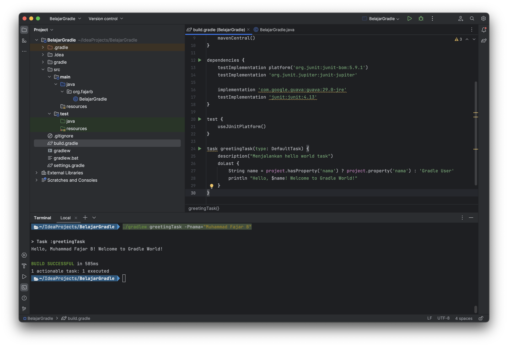

### Simple Custom Gradle Task

Membuat simple custom task gradle untuk mencetak output dengan menerima parameter CLI

### Running CLI
```zsh
./gradlew greetingTask -Pnama="Muhammad Fajar B" 
```
### Result
